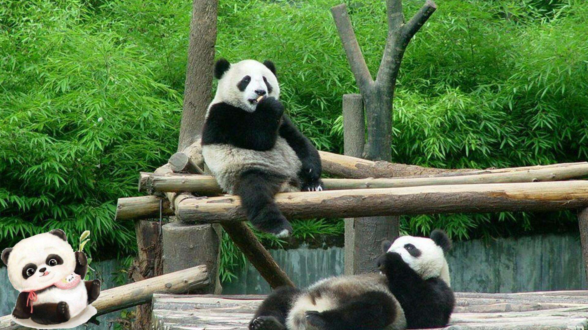

images
###########

image directive
*****************

The file name given (here gnu.png) must either be relative to the source file, or absolute (which means that they are relative to the top source directory)

code:

.. code-block:: rst

    .. image:: ../images/panda.jpg
        :width:  200pt
        :height: 400pt

output:

figure directive
******************

A figure consists of image data (including image options), an optional caption (a single paragraph), and an optional legend (arbitrary body elements):

   This is the caption of the figure (a simple paragraph).

   The legend consists of all elements after the caption.  In this
   case, the legend consists of this paragraph and the following
   table: